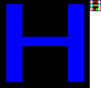

# cmsdf

Minimal C99 multi-channel signed distance field generator based on [msdfgen](https://github.com/Chlumsky/msdfgen)

## Usage

MSDFs are a technique for rendering font glyphs in different sizes efficiently on GPUs, by encoding distance information in textures.



Above is a 128x128 px rendering of LiberationMono-Regulars 'H' glyph from a 16x16 px multi-channel signed distance field.

cmsdf features a minimal CLI.
Generate the multi-channel signed distance field (MSDF) using:
```sh
cmsdf generate -f $FONT_PATH -c $CHARACTER -w $MSDF_WIDTH -h $MSDF_HEIGHT
```
That will place the MSDF in `out.bmp`.
A string can passed to the `-c`, which will generate an atlas containing all glyphs of the string.
For practical usage width and height should be at least 32 pixels.

Rendering can be previewed with:
```sh
cmsdf render -w $RENDER_WIDTH -h $RENDER_HEIGHT
```
which will read `out.bmp` and place the rendered glyph in `render.bmp`

For debugging it can be useful to see the edge - color channel assignment, which can be stored in `edges.bmp` by running `cmsdf edges` with the same arguments as `cmsdf generate`.

cmsdf requires a properly maintained font as input.
It does not correct errors in the font such as overlapping bezier curves and wrong winding orders.
Also structures, which may cause artifacts, e.g. extremely short edges, aren't pruned from the input.

## API

To generate a MSDF an edge decomposition needs to created first by calling:
```c
int cmsdf_decompose(const cmsdf_decompose_params* params, cmsdf_decompose_result* result);
```
The required parameters are a freetype2 face object (`FT_Face`), a unicode codepoint to select a character and the dimensions of the decomposition.
The functions returns 0 on success and an error code otherwise.
If the call is successful `result.edges.data` needs to be freed by the caller, if the decomposition is no longer needed.

The MSDF of a decomposition can be calculated by invoking:
```c
size_t cmsdf_raster_edges(const cmsdf_edge_array* edges, const cmsdf_raster_params* params, uint8_t* pixels);
```
The `edges` parameter can be taken from a `cmsdf_decompose_result`.
`cmsdf_raster_params` specifies the width and height of the MSDF and offset and stride, where to place it in `pixels`.
`pixels` itself is a buffer that will be filled with BGRA pixels (8-bit per component) encoding the MSDF.
The caller needs to ensure sufficient capacity to store an image with dimensions specified by `params->rec` at the given offset and stride.

Passing `NULL` for `params` returns `0` immediately as the `params` are required.
Passing `NULL` for `pixels` or `edges` immediately returns the minimal buffer size required in bytes to store the MSDF of the given size at an offset of `0` and a stride of the MSDFs width.
If all arguments are provided, the number of bytes written is returned.

`size_t cmsdf_draw_edges(const cmsdf_edge_array* edges, const cmsdf_raster_params* params, uint8_t* pixels)` works the same, except that it outputs an images showing the internal edge color channel assignment.

A MSDF generated by `cmsdf_raster_edges` usually requires error correction, which can be applied in-place with:
```c
void cmsdf_postprocess(const cmsdf_raster_params* params, uint8_t* pixels);
```
`pixels` needs to be large enough to accommodate elements with the given width and height at the specified offset and stride.
If `params` or `pixels` is `NULL`, `0` is returned immediately.

A MSDF can be rendered on the CPU with:
```c
size_t cmsdf_render(const cmsdf_render_params* params, uint8_t* pixels);
```
`params` contains:
- `msdf` is a pointer to BGRA pixels of at least `msdf_width * msdf_height` elements
- `render_width` and `render_height` specify the target resolution
- a boolean `anti_aliasing` flag

`pixels` is a buffer that will be filled with BGRA pixels (8-bit per component) encoding the rendered image.
The caller needs to ensure sufficient capacity to store an image with dimensions specified by `render_width` and `render_height`.
Passing `NULL` for pixels immediately returns the minimal buffer size required in bytes.
Otherwise the number of bytes written is returned.

A texture atlas can be generated with:
```c
int cmsdf_gen_atlas(const cmsdf_gen_atlas_params* params, cmsdf_gen_atlas_result* result, uint8_t* pixels);
```
`params` contains:
- a `FT_Face face` from freetype.
- the dimensions of each tile in `dim`.
- the `chars` to be generated and their respective `chars_len`.
- `flags` such as `CMSDF_GEN_ATLAS_VERBOSE` for debug output and `CMSDF_GEN_ATLAS_EDGES` to draw the edge color channel assignment.

Passing `NULL` for `pixels` returns the minimum size required in bytes in `result.len`.
That buffer needs to be zeroed before passing it to `cmsdf_gen_atlas()`.
The function returns `0` on success.

For an example please refer to the included CLI contained in `src/main.c`.

## Building

[cmake](https://cmake.org/) version 3.16 or greater and [freetype2](https://freetype.org/) is required. Initialize cmake with:
```sh
cmake -S . -B build -DCMAKE_BUILD_TYPE=Release
```
On Windows the paths to freetype2 likely need to specified with `-DFREETYPE_LIBRARY -DFREETYPE_INCLUDE_DIRS` in addition.
The following will build the cmsdf CLI in `build/cmsdf`:
```sh
cmake --build build --target cmsdf
```
